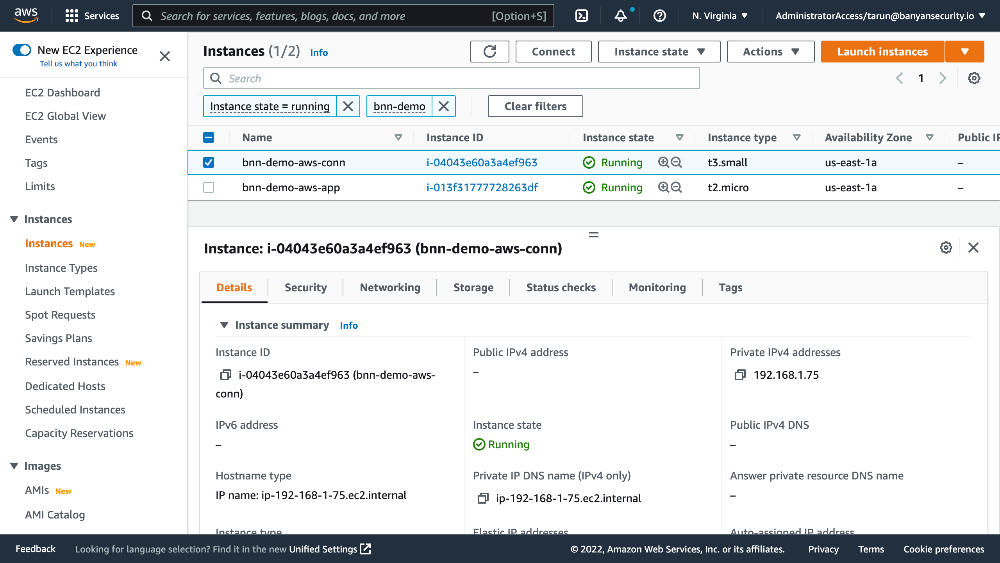
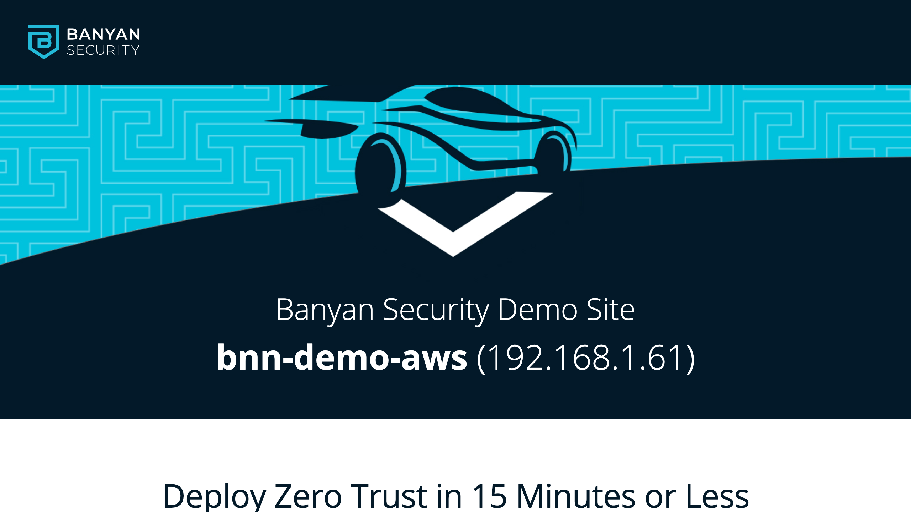

# Banyan Security demo for AWS environments using Terraform


## Prerequisities

To run this demo, you will need the following:

1. AWS account with credentials, and an EC2 key-pair
2. Terraform CLI 0.14.9+, configured for AWS provisioning
3. Banyan account and admin API key, and a device with the Banyan Desktop App installed

For instructions on how to set these up, go to the [Prerequisities Details section](#prerequisities-details).


## Run it

Clone this repo to your machine. Edit the `locals.tf` file with details from your environment.

```tf
locals {
  name_prefix = "bnn-demo"

  region = "us-east-1"
  profile = "default"  
  ssh_key_name = "YOUR_AWS_KEY_NAME"

  banyan_host = "https://team.console.banyanops.com/"
  banyan_api_key = "YOUR_BANYAN_API_KEY"
  banyan_org = "YOUR_BANYAN_ORG"
}
```

Then, provision all the resources:

```bash
terraform apply
```

Provisioning is broken up into 6 steps; the code is written so you can run it step-by-step by specifying each step during the apply as: `terraform apply -target=module.network`

1. **Network** - a new VPC with subnets
2. **Database** - an RDS instance
3. **Application** - an EC2 instance that runs a demo website container
4. **Banyan Connector** - deploy an EC2 instance with the `connector` to create an outbound connection to the Banyan Global Edge network, so you can manage access to your AWS environment
5. **Banyan Policies** - create a few roles and policies to establish which users and devices can access your AWS environment
6. **Banyan Services** - publish the services that are deployed in your AWS environment for your end users

This first 3 steps get you a basic but representative AWS environment. The last 3 steps set up Banyan to provide secure remote access to this environment.


## Access your AWS resources

All your deployed AWS resources - EC2 and RDS - are in private subnets with private IPs. They cannot be directly reached from the public internet.



To access your AWS resources from your device, open the Banyan App and click on a given service to connect to it.


Clicking "Open" on your web application `bnn-demo-web` will launch a new browser tab and take you the demo site after authentication.



To SSH into the Linux server, click "Connect" on the SSH service `bnn-demo-ssh`. Then run the SSH command with your EC2 key-pair as the credential:

```
$ ssh -i YOUR_AWS_KEY_NAME ubuntu@bnn-demo-ssh
Welcome to Ubuntu 20.04.4 LTS (GNU/Linux 5.13.0-1022-aws x86_64)

 * Documentation:  https://help.ubuntu.com
 * Management:     https://landscape.canonical.com
 * Support:        https://ubuntu.com/advantage

  System information as of Fri Apr 22 03:19:02 UTC 2022

...

Last login: Fri Apr 22 03:18:47 2022 from 192.168.1.204

ubuntu@ip-192-168-1-104:~$
``` 

To access your RDS instance, click "Connect" on the DB service `bnn-demo-db`. Then, fire up your favorite MySQL client and connect to your database at `127.0.0.1:8811`, using the credentials (`banyan:insecure` ) we configured via Terraform:

```
$ mysql --host=127.0.0.1 --port=8811 --user=banyan --password=insecure
mysql: [Warning] Using a password on the command line interface can be insecure.
Welcome to the MySQL monitor.  Commands end with ; or \g.
Your MySQL connection id is 1369
Server version: 5.7.37 Source distribution

...

Type 'help;' or '\h' for help. Type '\c' to clear the current input statement.

mysql> show databases;
+--------------------+
| Database           |
+--------------------+
| information_schema |
| innodb             |
| mydb               |
| mysql              |
| performance_schema |
| sys                |
+--------------------+
6 rows in set (0.11 sec)

mysql>
```

Behind the scenes, Banyan uses [short-lived cryptographic credentials](https://docs.banyansecurity.io/docs/intro/concepts/services/) to connect you to your AWS resources and a [zero trust security model](https://docs.banyansecurity.io/docs/intro/concepts/policies/) to enforce access control policies.


## Prerequisities Details

### AWS

This demo requires an AWS account. If you don't already have an AWS account, you can create a [free AWS account](https://aws.amazon.com/free/).

Then, you need to download AWS credentials that will allow you automate infra provisioning. You can create a new Access Key via the [IAM section of the AWS console](https://console.aws.amazon.com/iam/home?#/security_credentials).

Check that your AWS account and credentials are set up correctly by installing the [AWS CLI](https://docs.aws.amazon.com/cli/latest/userguide/install-cliv2.html). [Configure the AWS CLI](https://docs.aws.amazon.com/cli/latest/userguide/cli-chap-configure.html) from your terminal to use your credentials.

Finally, you need an EC2 key-pair that you will use if you need to SSH into the instances. If you don’t have a EC2 key-pair, you can [create a key-pair via the AWS CLI](https://docs.aws.amazon.com/cli/latest/userguide/cli-services-ec2-keypairs.html#creating-a-key-pair).


### Terraform

This demo uses Terraform. Follow the [getting started in AWS tutorial](https://learn.hashicorp.com/tutorials/terraform/install-cli?in=terraform/aws-get-started) to install the Terraform CLI (v0.14.9+), learn the basics of Terraform and configure authentication for AWS.


### Banyan

This demo shows you to how to use Banyan Security Zero Trust Remote Access. If you don't have a Banyan account, sign up for a [free Banyan account](https://www.banyansecurity.io/team-edition-signup/).

Take note of your Org name. Navigate to the API Keys section in the Banyan Command Center console and [create an admin API key](https://docs.banyansecurity.io/docs/banyan-components/command-center/api-keys/). Also, [install the Banyan Desktop App on your device](https://support.banyanops.com/support/solutions/folders/44000931532).


